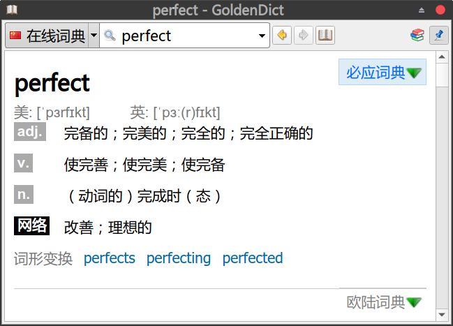

# 必应极简在线词典 for GoldenDict
目前很多基于python的必应在线词典失效，简单造了一个，只保留基本释义，去除例句等其他功能，目标是配合goldendict使用。

### **使用方法:**

依赖：需要 python3 ，安装 requests, BeautifulSoup

### 命令行

```shell
python3 bingdict.py  <text-to-be-translated>
```

输出html格式

### 添加到GoldenDict

GoldenDict - 编辑 - 字典 - 字典来源 - 程式

命令行: `python <path-to-bingdict.py> %GDWORD%`

类型: `html`

名称: `必应词典` 

### 截图

